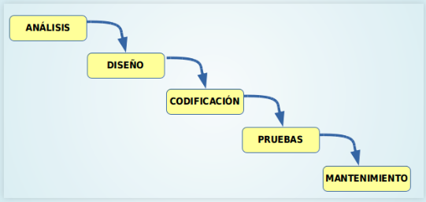
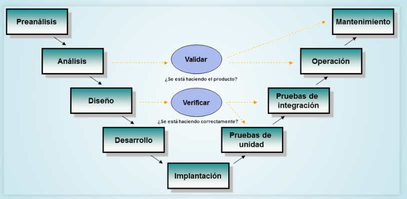

# **APUNTS UF 1.1**

## **TIPUS DE SOFTWARE**

**TIPUS**  | **QUE ÉS?** |  **EXEMPLE**
--|---|--
**DE SISTEMA**  | El software de sistema és un tipus que ens permet interactuar amb el hardware o altres programes.  |  Sistema operatiu, drivers.
**APLICACIÓ**  | El software d'aplicació es aquell software que ens permet realitzar un conjunt de funcions.  |  Suite ofimàtica, navegador, edició d'imatge.
**DESENVOLUPAMENT**  | El software de desenvolupament és aquell que ens permet desenvolupar aplicacions.  |  Editors, compiladors, interpretes.

## **RELACIÓ HARDWARE-SOFTWARE**

**HARDWARE**  | **RELACIÓ**
--|--
**DISC DUR**  |  Emmagatzema de forma permanent els arxius executables i els arxius de dades.
**MEMÒRIA RAM**  |  Emmagatzema de manera temporal el codi binari dels arxius executables i els arxius de dades necessàries.
**CPU**  |  Llegeix i executa les instruccions emmagatzemades en la memòria RAM i les dades necessàries.
**E/S**  |  Agafa noves dades dels perifèrics d'entrada, es mostren els resultats, es llegeixen o guarden les dades a disc, etc.

## **TIPUS DE CODI**

**TIPUS**  |  **QUE ÉS?**
--|--
**CODI FONT**  |  És un arxiu de text llegible en un llenguatge de programació.
**CODI OBJECTE**  |  És un arxiu binari el qual no és pot executar.
**CODI EXECUTABLE**  |  És un arxiu binari el qual és pot executar.

## **CICLE DE VIDA DEL SOFTWARE**

**1 - ANÀLISIS:** És determinen i defineixen les necessitats del client i s'especifiquen els requisits que a de complir el software que anem a desenvolupar.

**2 - DISSENY:** És desglossa i s'organitza el sistema en elements més petits els quals poden ser desenvolupats per separar i facilitar la codificació.

**3 - CODIFICACIÓ:** S'escriu el codi font per a cada component. Depenent de les nostres necessitats podem utilitzar un llenguatge o un altre.

**4 - PROVES:** Serveixen per detectar possibles errors en el software.

**5 - MANTENIMENT:** De tant en tan s'han de fer modificacions, ja sigui per corregir errors, millorar una funció ja existent, afegir noves funcionalitats o adaptar el software a nous entorns.

## **RESULTAT DESPRÈS DE CADA FRASE**

**FASE**  | **RESULTAT**  
--|--
**ENGINYERIA DE SISTEMES**   |  Obtindrem les especificacions del sistema.
**ANÀLISIS**  |  Obtenim les especificacions de requisits del software
**DISSENY ARQUITECTÒNIC**  | Document d'arquitectura del software-
**DISSENY DETALLAT**  |  Aconseguirem les especificacions dels mòduls i funcions.
**CODIFICACIÓ**  |  Obtenim el codi font del nostre software.
**PROVES D'UNITATS**  |  Aconseguir obtenir els mòduls utilitzables.
**PROVES D'INTEGRACIÓ**  |  Aconseguim obtenir el sistema ja utilitzable.
**DOCUMENTACIÓ**  |  Documentació tant tècnica com d'usuari.
**MANTENIMENT**  |  Tindrem els informes d'errors i control de canvis.

## **MODELS DE DESENVOLUPAMENT DE SOFTWARE**

### MODEL EN CASCADA

És el model de major antiguitat. Identifica les fases principals del desenvolupament del software i en aquest mètode és tenen que realitzar les fases en el orde indicat.

Aquest model es bastant rígid i no s'adapta bé als canvis continuats d'especificacions.

### MODEL EN V

És un model semblant al model en cascada, té una visió jerarquitzada amb diferents nivells, els nivells superiors indican major abstracció i els inferiors indican major detall.

