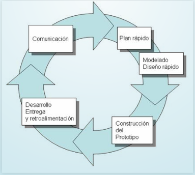
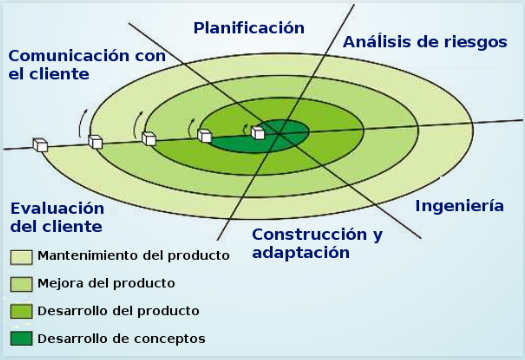
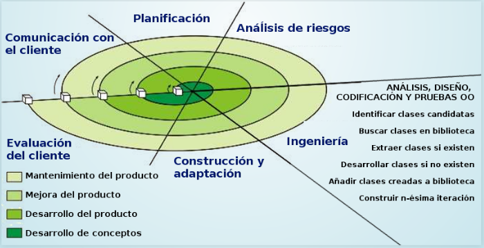
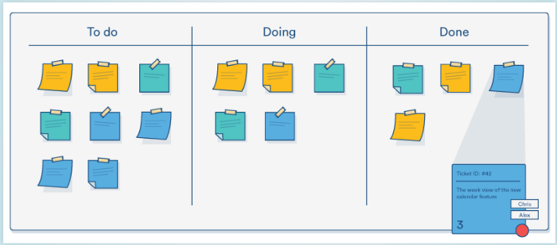
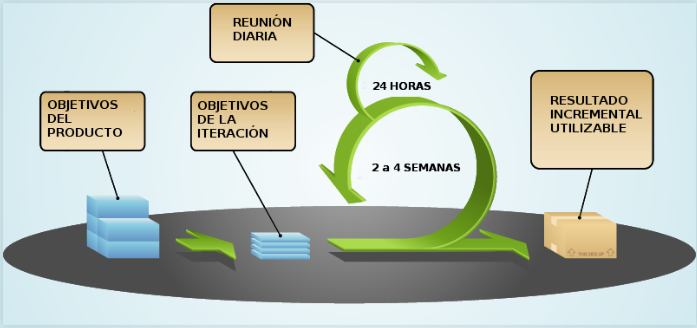
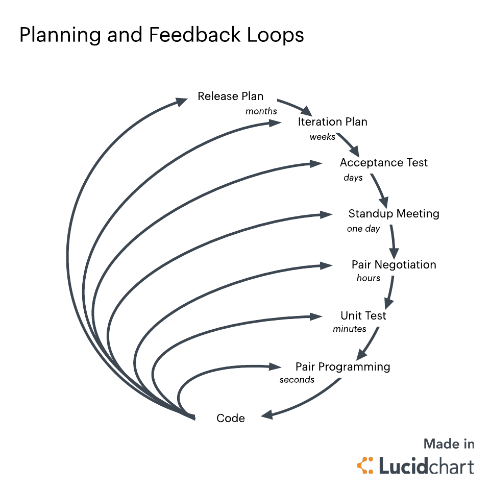

# **APUNTS UF 1.1**

## **TIPUS DE SOFTWARE**

**TIPUS**  | **QUE ÉS?** |  **EXEMPLE**
--|---|--
**DE SISTEMA**  | El software de sistema és un tipus que ens permet interactuar amb el hardware o altres programes.  |  Sistema operatiu, drivers.
**APLICACIÓ**  | El software d'aplicació es aquell software que ens permet realitzar un conjunt de funcions.  |  Suite ofimàtica, navegador, edició d'imatge.
**DESENVOLUPAMENT**  | El software de desenvolupament és aquell que ens permet desenvolupar aplicacions.  |  Editors, compiladors, interpretes.

## **RELACIÓ HARDWARE-SOFTWARE**

**HARDWARE**  | **RELACIÓ**
--|--
**DISC DUR**  |  Emmagatzema de forma permanent els arxius executables i els arxius de dades.
**MEMÒRIA RAM**  |  Emmagatzema de manera temporal el codi binari dels arxius executables i els arxius de dades necessàries.
**CPU**  |  Llegeix i executa les instruccions emmagatzemades en la memòria RAM i les dades necessàries.
**E/S**  |  Agafa noves dades dels perifèrics d'entrada, es mostren els resultats, es llegeixen o guarden les dades a disc, etc.

## **TIPUS DE CODI**

**TIPUS**  |  **QUE ÉS?**
--|--
**CODI FONT**  |  És un arxiu de text llegible en un llenguatge de programació.
**CODI OBJECTE**  |  És un arxiu binari el qual no és pot executar.
**CODI EXECUTABLE**  |  És un arxiu binari el qual és pot executar.

## **CICLE DE VIDA DEL SOFTWARE**

**1 - ANÀLISIS:** És determinen i defineixen les necessitats del client i s'especifiquen els requisits que a de complir el software que anem a desenvolupar.

**2 - DISSENY:** És desglossa i s'organitza el sistema en elements més petits els quals poden ser desenvolupats per separar i facilitar la codificació.

**3 - CODIFICACIÓ:** S'escriu el codi font per a cada component. Depenent de les nostres necessitats podem utilitzar un llenguatge o un altre.

**4 - PROVES:** Serveixen per detectar possibles errors en el software.

**5 - MANTENIMENT:** De tant en tan s'han de fer modificacions, ja sigui per corregir errors, millorar una funció ja existent, afegir noves funcionalitats o adaptar el software a nous entorns.

## **RESULTAT DESPRÈS DE CADA FRASE**

**FASE**  | **RESULTAT**  
--|--
**ENGINYERIA DE SISTEMES**   |  Obtindrem les especificacions del sistema.
**ANÀLISIS**  |  Obtenim les especificacions de requisits del software
**DISSENY ARQUITECTÒNIC**  | Document d'arquitectura del software-
**DISSENY DETALLAT**  |  Aconseguirem les especificacions dels mòduls i funcions.
**CODIFICACIÓ**  |  Obtenim el codi font del nostre software.
**PROVES D'UNITATS**  |  Aconseguir obtenir els mòduls utilitzables.
**PROVES D'INTEGRACIÓ**  |  Aconseguim obtenir el sistema ja utilitzable.
**DOCUMENTACIÓ**  |  Documentació tant tècnica com d'usuari.
**MANTENIMENT**  |  Tindrem els informes d'errors i control de canvis.

## **MODELS DE DESENVOLUPAMENT DE SOFTWARE**

### MODEL EN CASCADA

És el model de major antiguitat. Identifica les fases principals del desenvolupament del software i en aquest mètode és tenen que realitzar les fases en el orde indicat.

Aquest model es bastant rígid i no s'adapta bé als canvis continuats d'especificacions.

### MODEL EN V

És un model semblant al model en cascada, té una visió jerarquitzada amb diferents nivells, els nivells superiors indican major abstracció i els inferiors indican major detall.

### PROTOTIPS

És crea un prototip durant la fase d'anàlisis i es provat per l'usuari/client per a perfeccionar els requisits del software a desenvolupar.

Aquest pas és repeteix totes les vegades que facin falta.

Hi ha dos tipus de prototips:

- **PROTOTIP RÀPID:** aquest tipus de prototip pot estar desenvolupat utilitzant un altre llenguatge i/o eines i finalment el prototip és rebutja.

- **PROTOTIP EVOLUTIU:** aquest tipus de prototip està desenvolupat en el mateix llenguatge i eines del projecte, s'utilitza coma a base per al desenvolupament del projecte.

  

### MODEL EN ESPIRAL

Aquest model va ser desenvolupat per Boehm en 1988.

L'activitat d'enginyeria correspon a les fases dels models clàssics, anàlisis, disseny, codificació, proves i manteniment.

  

#### MODEL EN ESPIRAL APLICAT A LA PROGRAMACIÓ ORIENTADA A OBJECTES

En l'activitat de enginyeria es da gran importància a la reutilització de codi.

  

### METODOLOGIES ÀGILS

Aquests mètodes d'enginyeria del software estan basats en el desenvolupament iteratiu e incremental, els requisits i solucions evolucionen amb el temps i segons les necessitats del projecte.

El treball és realitzat mediant la col·laboració d'equips auto-organitzats i multidisciplinaris.

#### TIPUS DE METODOLOGIES ÀGILS MÉS CONEGUDES

- Kanban
- Scrum
- XP (eXtreme Programming)

#### QUE ÉS KANBAN?

Kanban, també anomenat "sistema de targetes" va ser desenvolupat inicialment per Toyota per a la industria de fabricació de productes.

Controla per demanda la fabricació dels productes necessaris en la quantitat i temps necessaris, està enfocat a entregat el màxim valor per als clients utilitzant els recursos justos.

  

#### CARACTERÍSTIQUES SCRUM

- Model de desenvolupament incremental.
- Iteracions regulades cada 2, 3 o 4 setmanes.
- Al principi de cada iteració s'estableixen els objectius prioritaris i al finalitzar-la s'obté una entrega parcial utilitzable per el client.
- Es realitzen reunions diàries per tractar com va la iteració.

  

#### CARACTERÍSTIQUES XP (PROGRAMACIÓ EXTREMA)

- Disseny senzill.
- Petites millores continues.
- Proves i re-factorització.
- Integració continua.
- Programació per parelles.
- El client s'integra amb l'equip de desenvolupament.
- Propietat del codi compartida.
- Estàndard de codificació.
- 40 hores setmanals.

  

